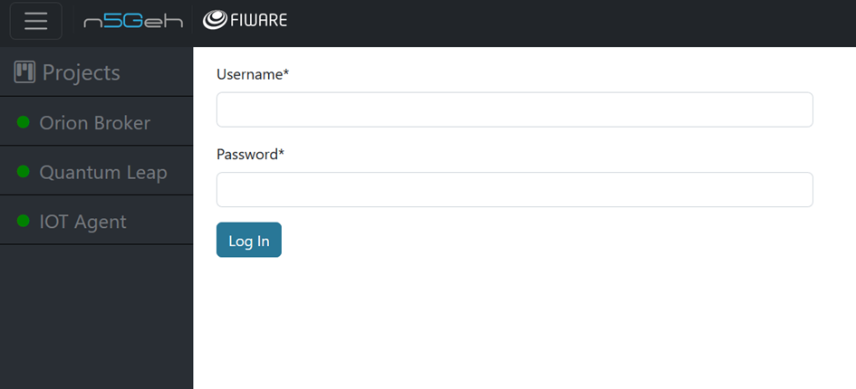
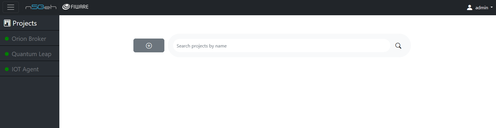
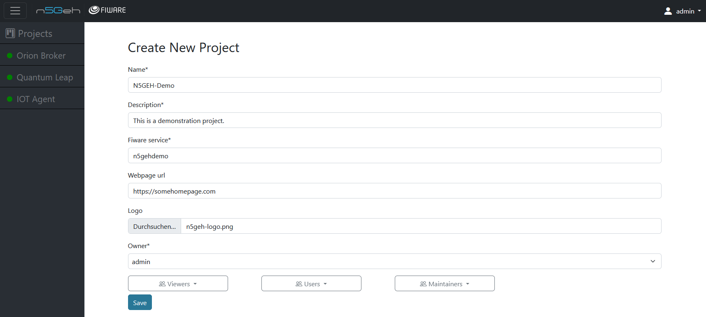
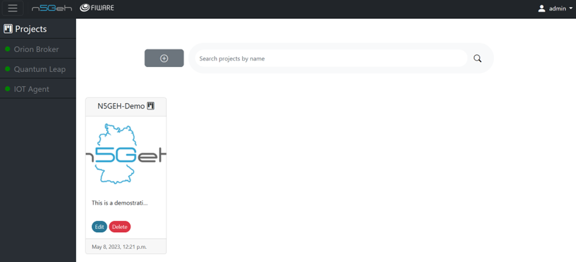
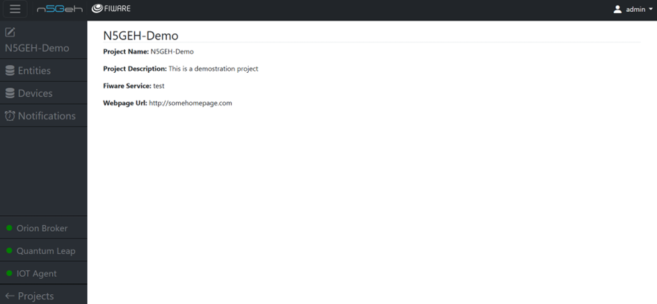

# Entirety GUI Tutorials

Entirety is web-based tool developed to facilitate the work with dedicated FIWARE APIs. It is structured into different modules that are designed to interact with specific FIWARE Generic Enablers (GEs). This tutorial will guide you through the basics of Entirety GUI and then through the usage of every module.

##	*LOGIN*

- You can login to the Entirety tool with you Entirety username and password.
- Based on your access rights , you can login as an `admin` or a `project_admin` or a `user`.

    1. Admin : Admin has all the admin rights like adding of projects , assigning owners to a project and adding/removing user.
    2. Project Admin : Project admin can manage the different projects by creating new projects , assigning users and maintainers to a project and editing projects.
    3. User : Users are only allowed to edit a particular project which is assigned to them.

## *PROJECTS*

Entirety uses the concept of projects to separate the database into independent data spaces. Each project is bound to specific "fiware-service" headers, following FIWARE's approach to multi-tenancy. This ensures that projects can only access and manipulate data that they created and are authorized for.
-	Click on Projects on the top left corner to see the current projects.
-	You can only add a new project if you have the roll `project_admin` or `admin`.

-	For creating a new project , click on the + and fill in the fields with you project details like project name , project description , Fiware service and webpage url.
-	You can also add a project logo by choosing a file and uploading it.
-	You must assign owners for the project and select the maintainers and users

-	Once you are done saving your project , click on Project image to view your project .
-	Add edit page

-	See the description of the project and also the available apps on the sidebar

## *Modules*
Modules are developed to interact with FIWARE Generic Enablers (GEs)Entities , currently, Entirety supports interaction with the following Generic Enablers: Orion, IoT Agent-JSON, and QuantumLeap. Accordingly, the Apps "Entities", "Devices", and "Notifications" are developed to communicate with these GEs.
The following pages will guide you through each module.

1. [Entities](GUI_TUTORIALS/ENTITIES.md)
2. [Devices](GUI_TUTORIALS/DEVICES.md)
3. [Notifications](GUI_TUTORIALS/NOTIFICATIONS.md)
