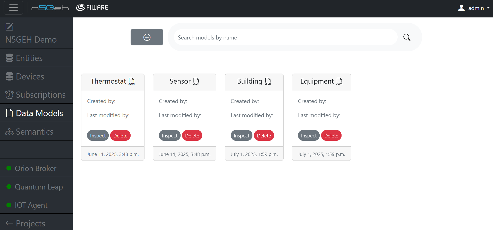
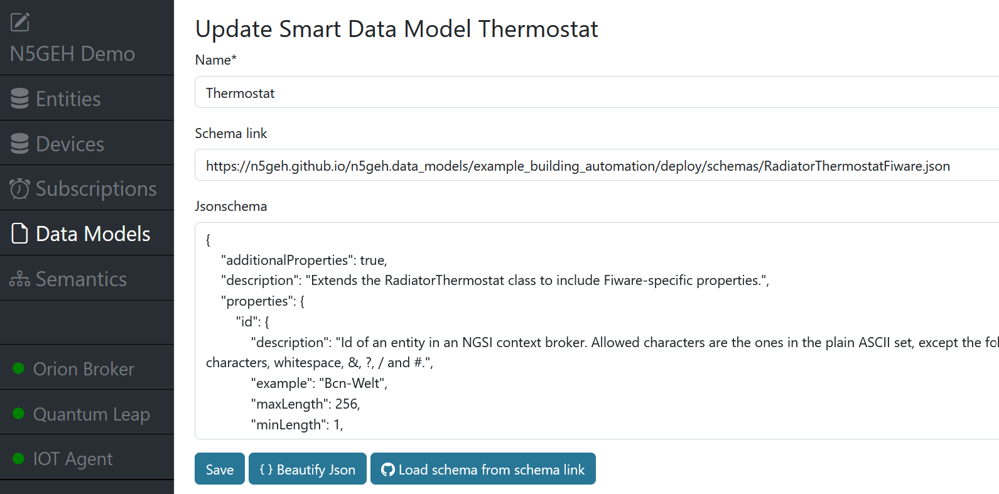
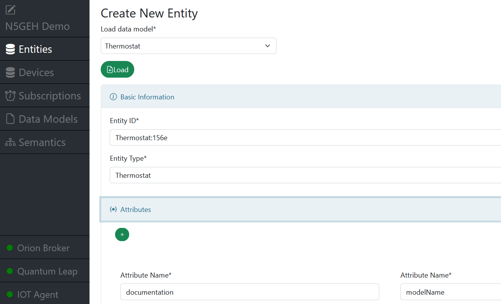
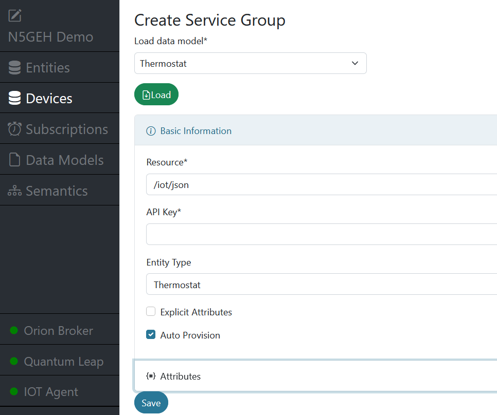

# *DATA MODELS MODULE*

Data models define the structure and vocabularies of data in FIWARE platforms.
It helps to improve the reusability and interoperability of data.
In Entirety, the Data Models module allows users to create, manage, and use data models in other related modules such as `Entities` and `Devices`.

- [Data Models Module](#data-models-module)
  - [Create Data Models](#create-data-models)
  - [Manage Data Models](#manage-data-models)
  - [Use Data Models](#use-data-models)

On the landing page of the *Data Models* module, you can see a list of all data models that belong to the project.

## Create Data Models
To create a "new" data model, click on the *+* button in the top left.
By "new" we mean that you can either create a completely new data model from scratch or you can import an existing data model from a URL or copy the source code directly from another source.
We recommend to always use import function if possible, as it will ensure that the data model is findable and reusable in the future.

For example, in the creation dialog, you can specify a URL (``Scheme link``) to access the data model, such as a data model that we host via GitHub pages: https://n5geh.github.io/n5geh.data_models/example_building_automation/deploy/schemas/RadiatorThermostatFiware.json.
And then, by clicking on the *Load* button, the data model will be loaded into the text fields.

> **Note:** Here you can find more example data models: https://github.com/N5GEH/n5geh.data_models/tree/main/example_building_automation

If your data model is not publicly accessible, you can also copy the source code directly into the text fields.
The same applies if you want to create a new data model from scratch.
The *Beautify JSON* button will format the JSON code for better readability.

Finally, you can click on the *Save* button to save the data model.

## Manage Data Models

As can be seen in the landing page, all data models are listed.
You can update (click on the *Inspect* button) or delete (click on the *Delete* button) a data model.

## Use Data Models
Data models can be used in the `Entities Module` and `Devices Module` to pre-fill the fields of entities or devices/service groups.
When creating a new entity or device/service groups, you can select a data model from the dropdown menu.

**In Entities Module:**

Here you can pre-fill the *Entity Type* and the attributes of the entity.
An ID is automatically generated, but can be changed.

**Device/Service Group**:

Here it is recommended to use data models to create service groups for a specific device type.
With the ``Auto Provision`` option, you can enable the automatic creation of entities (following the data model) when a new device starts sending data to the IoT Agent.
