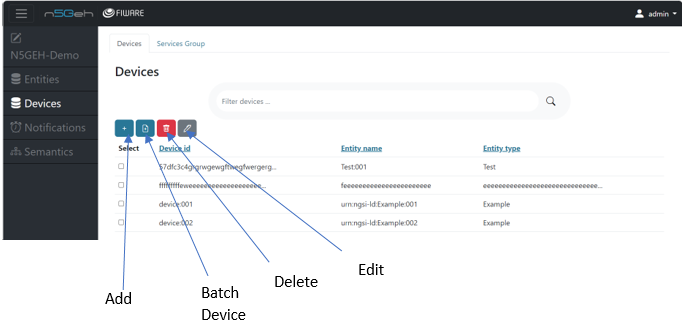
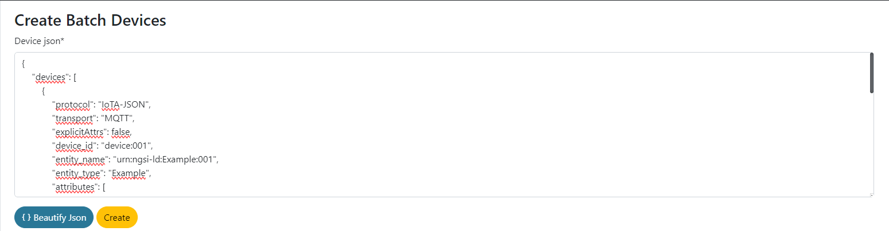
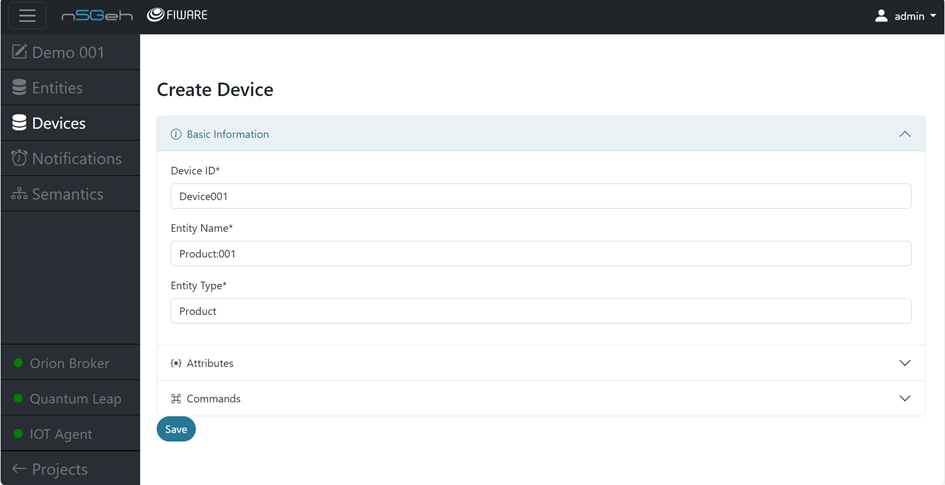
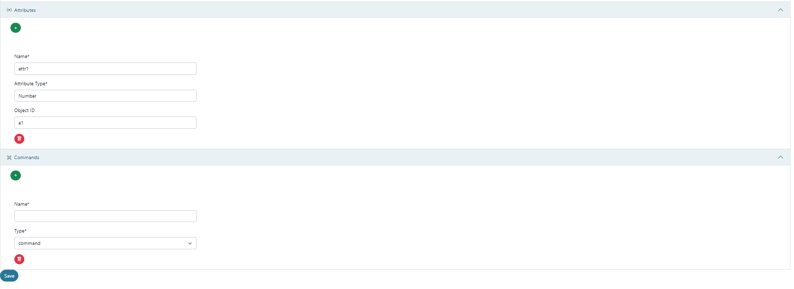
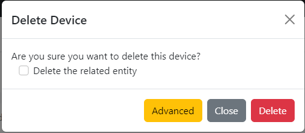
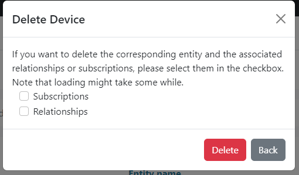

# *DEVICES MODULE* 

[Introduction](#Introduction)

[Create New Device](#Create_New_Device)

[Delete Device](#Delete_Device)

## *Introduction*
-	The Devices app is developed to interact with the FIWARE Generic Enabler known as IoT Agent-JSON.
-	IoT Agents are used to manage devices/servivce and their interactions in the FIWARE ecosystem. The Devices app allows users to handle the registration, update, and removal of devices.
-	Users working with the Devices app are able to register new devices, update device information, and remove devices from the system. This involves specifying device attributes, protocols, and other relevant details.

-	By clicking on the blue + , you can add new Devices , by clicking on the red bin you can delete a specific Device and by clicking on the grey pen you can edit an already existing Device. You can choose which entity to perform actions by selecting the white box.
-	You can also create Batch Devices , by clicking on the batch devices option. 
- This options lets you a batch of multiple devices that you might have. this needs to be done my adding a JSON representation describing your multiple devices along with their associated attributes and metadata.

## *Create New Device*
-	Creating a new Device : On clicking the blue + , you can create a new Device by filling in the Device ID , Device Name and the Device Type.

- Here you can link the new device to an Entity by specifying the Entity Name and Entity Type.
-	You can also add in multiple Device attributes for a specific Device by adding the Attribute Name, Attribute Type and Object ID (optional).
-	You can also add in multiple Device Commands for a specific Device by adding the Command Name and Command Type. 

## *Delete Device*
- Deleting a Device : For deleting a Device , you can select the desired Device and click on the *red bin* , this will open a dialog box which prompts ‘Delete the related entity‘ and gives you option for Advanced settings or deleting the device forcefully. 

- You can delete the entity related to this device by seleting the box.
- Clicking the advanced setting option will again open a dialog box which prompts 'If you want to delete the corresponding entity and the associated relationships or subscriptions, please select them in the checkbox'.
- You can now select if you want to delete the relationships and subscriptions related to this particular device and delete them as well along with the device. 

 
 
 
 [Entirety GUI](https://github.com/N5GEH/n5geh.tools.entirety/blob/106-documentation-GUI/docs/GUI_TUTORIALS.md))
