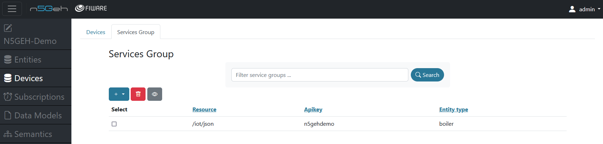

# DEVICES MODULE

The "Devices" module is developed to interact with the FIWARE Generic Enabler known as IoT Agent-JSON, which manages `devices` and `service group` and their interactions within the FIWARE platform. The basic functionalities include creation, update, and removal of devices. Furthermore, the IoT Agent-JSON offers the use service groups to group certain devices and enable bi-directional communication, e.g. for the use of commands.

A detailed description of the terminology can be found in the docoumentation of the [IoT Agent Node Lib](https://iotagent-node-lib.readthedocs.io/en/latest/api.html) and the [IoT Agent JSON](https://fiware-iotagent-json.readthedocs.io/en/latest/usermanual.html).

- [DEVICES MODULE](#devices-module)
  - [Devices](#devices)
    - [Create New Device](#create-new-device)
    - [Create Multiple Devices](#create-multiple-devices)
    - [Delete Device](#delete-device)
  - [Service Groups](#service-groups)

On the landing page of the "Devices" module, the [*Devices*](#devices) tab is selected. You can also switch to the [*Service Groups*](#service-groups) tab.

## Devices

Upon load of the devices tab, a list of all devices that belong to the project are displayed. The handling is very similar to the [entities module](ENTITIES.md).
By clicking on the *+* , you can add new devices. By clicking on the *bin*, you can delete a specific device. And by clicking on the *eye*, you can edit an already existing device.
Furthermore, you can create Batch Devices by clicking on the batch devices option.
You can choose which device to perform actions on by selecting the white selection box in the left column.

### Create New Device
By clicking the blue *+* , you can create a new device by filling in the *Device ID, Device Name* and the *Device Type*.

Either create a device from scratch or pre-load information from a data model.

- The new device will be linked to an Entity by specifying the *Entity Name* and *Entity Type*.
- Multiple device attributes can be added by filling in the *Attribute Name*, *Attribute Type* and *Object ID* (optional).
- You can also add multiple device commands for a specific device by adding the *Command Name* and *Command Type*.

### Create Multiple Devices
If you are familiar with the syntax of the IoT Agent JSON, you can use this option to fill in a valid JSON and create multiple devices. 

### Delete Device
- To delete a device, you can select the desired device and click on the *bin*, this will open a dialog box which gives you options for deleting the device.

- You can choose to delete the entity related to this device by clicking the select box before deleting.
- Additionally, you can click the *Advanced* button to delete further entity-related information like subscriptions and relationships which are associated to the connected entity.

## Service Groups

Upon load of the service groups tab, all available service groups are listed. The handling of the service groups tab is the same as for the devices tab.

For each service group, the fields *Resource* and *API Key* are mandatory. The *Resource* "/iot/json" is pre-filled but can be changed. Furthermore, an *Entity Type* can be linked to the service group, only explicit attributes can be accepted or auto provisioning can be enabled.

Back: [Entirety GUI](../USERGUIDE.md#modules)

Further: [Subscriptions](Subscriptions.md)
