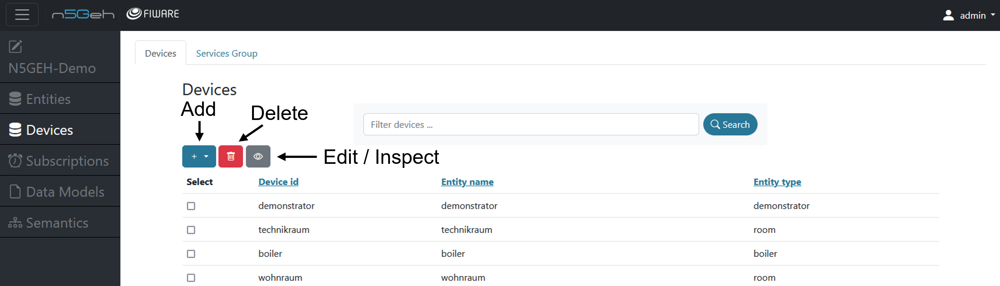
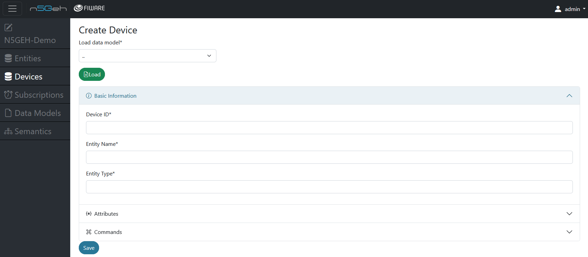

# *DEVICES MODULE* 

The "Devices" module is developed to interact with the FIWARE Generic Enabler known as IoT Agent-JSON, which manages `devices` and `service group` and their interactions within FIWARE platform. The basic functionalities include registration, update, and removal of devices.

On the landing page of "Devices" module, you can see a list of all devices that belong to the project. 
By clicking on the blue + , you can add new Devices , by clicking on the red bin you can delete a specific Device and by clicking on the grey pen you can edit an already existing Device.
Besides, you can also create Batch Devices , by clicking on the batch devices option.
You can choose which device to perform actions by selecting the white box.

- [Create New Device](#create-new-device)
- [Create Multiple Devices](#create-multiple-devices)
- [Delete Device](#delete-device)

## *Create New Device*
-	Creating a new Device : On clicking the blue + , you can create a new Device by filling in the Device ID , Device Name and the Device Type.

- Here you can link the new device to an Entity by specifying the Entity Name and Entity Type.
- You can also add in multiple Device attributes for a specific Device by adding the Attribute Name, Attribute Type and Object ID (optional).
- You can also add in multiple Device Commands for a specific Device by adding the Command Name and Command Type. 

## *Create Multiple Devices*
This options lets you a batch of multiple devices that you might have. this needs to be done by adding a JSON representation describing your multiple devices along with their associated attributes and metadata.

TODO

## *Delete Device*
- Deleting a Device : For deleting a Device , you can select the desired Device and click on the *red bin* , this will open a dialog box which prompts ‘Delete the related entity‘ and gives you option for Advanced settings or deleting the device forcefully. 

- You can delete the entity related to this device by seleting the box.
- Clicking the advanced setting option will again open a dialog box which prompts 'If you want to delete the corresponding entity and the associated relationships or subscriptions, please select them in the checkbox'.
- You can now select if you want to delete the relationships and subscriptions related to this particular device and delete them as well along with the device. 

Back: [Entirety GUI](../GUI_TUTORIALS.md#modules)

Further: [Notification ](NOTIFICATIONS.md)