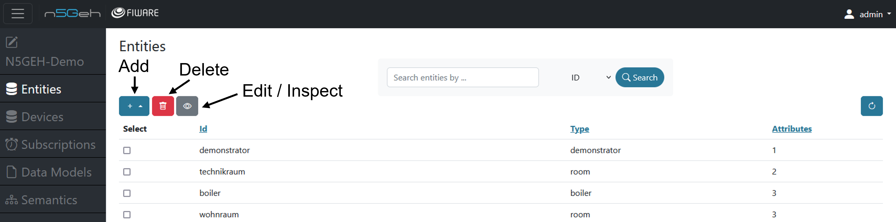
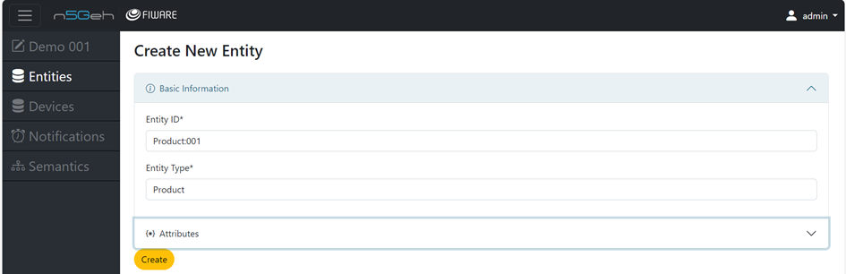
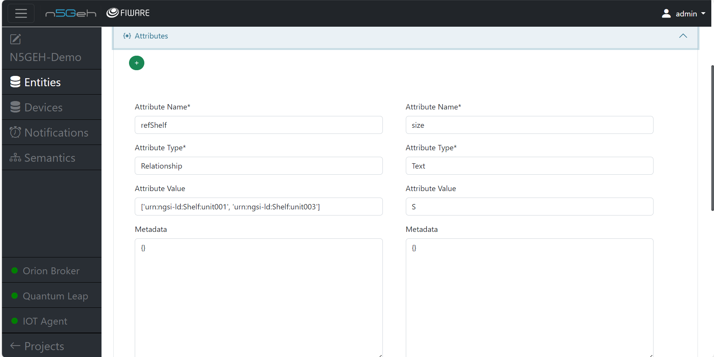
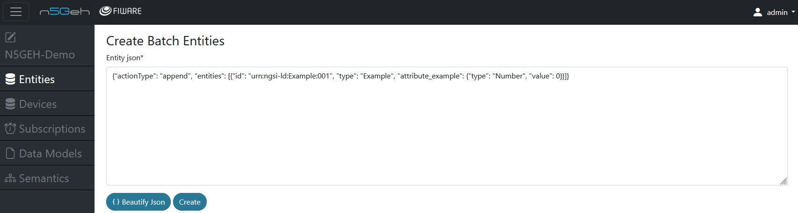
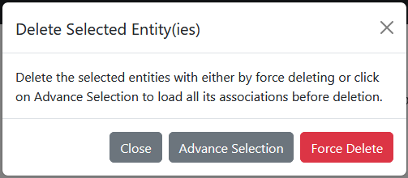
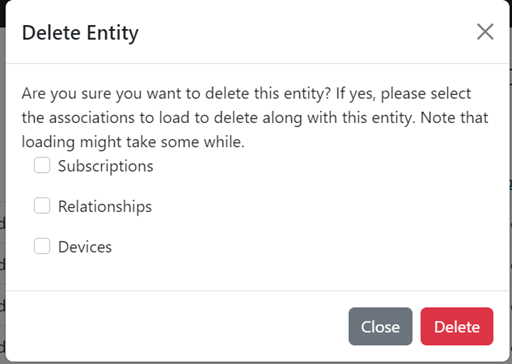

# Entities Module

The Entities module is developed to interact with the Orion Context Broker (CB).
It allows users to manage entities within the CB.
In the FIWARE context, entities hold information in a smart solution, typically corresponding to real-world objects or abstract entities.

Users are able to create, update, retrieve, and delete entities via the "Entities" module. By clicking on the *+* , you can add new entities, by clicking on the *bin* you can delete all selected entities and by clicking on the *eye* you can inspect and edit the selected entity. You can choose which entity to perform actions on by checking one or many of the check boxes on the left hand side of each entity row.

You can use the search bar at the top to filter for entities by either ID or type. Currently, the search is case sensitive!

- [Entities Module](#entities-module)
  - [Create Entity](#create-entity)
  - [Create Multiple Entities:](#create-multiple-entities)
  - [Delete an Entity](#delete-an-entity)

## Create Entity

By clicking the *+*, you can either create a single entity or have the possibility to batch create one or more entities. Click on *Create Entity*.
-	Create Entity: By clicking the *+* , you can create a new entity in two ways:
    - Raw: By filling in the *Entity ID* and the *Entity Type*. Attributes can be added but are not mandatory. If you add an attribute, *Attribute Name* and *Attribute Type* are mandatory while *Attribute Value* and *Metadata* are optional.
    - From data model: You can also load *Entity Type* and pre-defined attributes by loading from a data model. Choose an existing data model and click on the *Load* button.

By checking an entity and clicking on the *eye* button, you can inspect an entity.
The dialog is the same as for creating an entity but the fields ID and type cannot be changed. A click on the red bin below each attribute will delete the attribute. *Note:* You have to click the *Update* button at the bottom in order to make the changes effective.

## Create Multiple Entities: 
    
If you are familiar with the syntax of the context brokers, you can use this option to fill in a valid JSON and create multiple entities and their attributes. 

## Delete an Entity

To delete an entity, select the desired entity and click on the *bin*. This will open a dialog box with different options as described below.
 

- Close: Deletion will be aborted.
-	Force Delete: Delete an entity without deleting their possible associations.
-	Advanced selection: This option will open another dialog box which offers three options for deleting the associations of the entity which are: *1. Subscriptions 2. Relationships 3.Devices*

The advanced selection for deleting an entity allows you to delete the subscriptions, relationships and devices that this particular entity is linked with.

Back: [Entirety GUI](../USERGUIDE.md#modules)

Further: [Devices](DEVICES.md)
