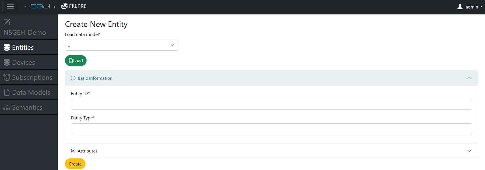
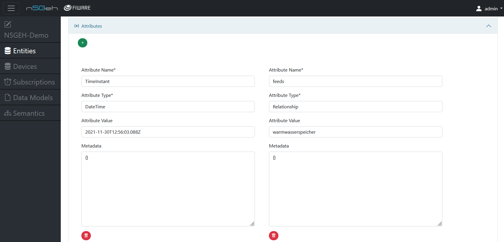
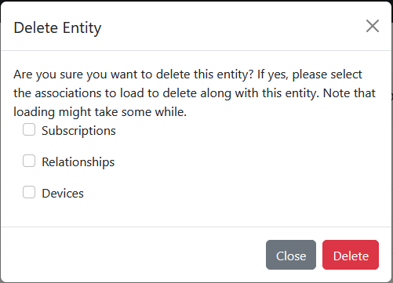

# *Entities Module*

The Entities app is developed to interact with the Orion Context Broker (CB).
It allows users to manage entities within the CB.
Entities, in the FIWARE context, holds information in a smart solution, typically corresponding to real-world objects or abstract entities.

Users are able to create, update, retrieve, and delete entities via "Entities" module. By clicking on the *blue +* , you can add new entities , by clicking on the *red bin* you can delete a specific entity and by clicking on the *grey pen* you can edit an already existing entity. You can choose which entity to perform actions by selecting the white box.

- [Create New Entity](#Create_New_Entity)
- [Delete an Entity](#Delete_an_Entity)

## *Create New Entity*
-	Creating a new entity : On clicking the *blue +* , you can create a new entity by filling in the *Entity ID* and the *Entity Type*. 
- The ID of the entity should always be a combination of *Entity ID* and *Entity type* in the following manner: 'Type:ID'

-	You can also add in multiple entity attributes for a specific entity by adding the *Attribute Name, Attribute Type, Attribute Value (optional) and Metadata (optional)*.

## *Delete an Entity*
-	For deleting an entity , you can select the desired entity and click on the *red bin* , this will open a dialog box which prompts ‘Delete the selected entities with either by force deleting or click on Advance Selection to load all its associations before deletion.‘ 
 

-	With this option you can either force delete an entity without deleting their associations or click on the advanced selection and delete the associations.
-	On clicking the advanced selection , it will open another dialog box which has three options to choose from for deleting the associations.
-	They are as follows :  *1. Subscriptions 2. Relationships 3.Devices*

-	This lets you delete the subscriptions, relationships and devices this particular entity is linked with.

Back: [Entirety GUI](https://github.com/N5GEH/n5geh.tools.entirety/blob/106-documentation-GUI/docs/GUI_TUTORIALS.md/#Modules)

Further: [Devices](GUI_TUTORIALS/DEVICES.md)
