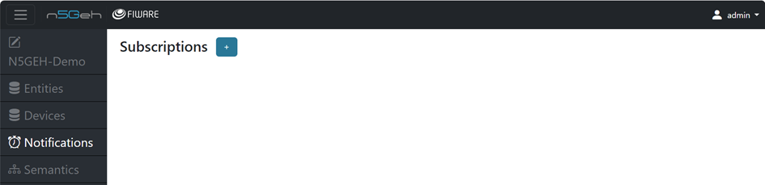
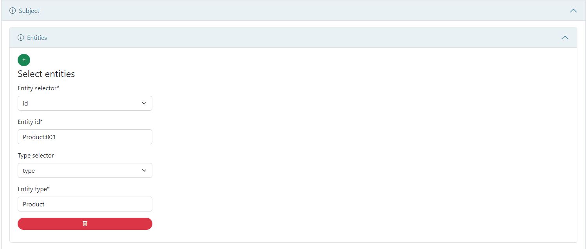
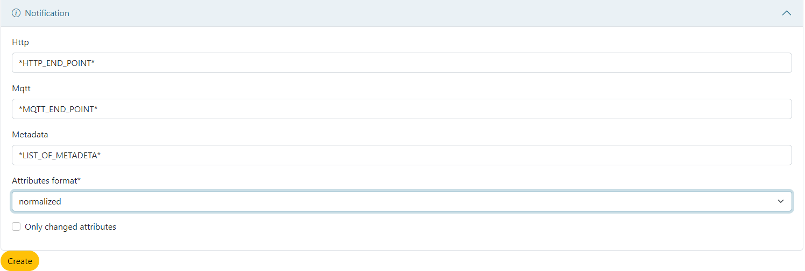

# *NOTIFICATION MODULE*

-	The Notifications app is designed to interact with the FIWARE Generic Enabler called QuantumLeap.
-	QuantumLeap is often used for managing historical context data and handling subscriptions for changes in data. The Notifications app provides a user interface to manage and view notifications related to changes in context information.
-	Users utilizing the Notifications app are able to subscribe to changes in specific entities or attributes, view historical context data, and manage notification settings.

-	Creating a new Subscription: On clicking the blue + , you can create a new Subscription by filling in the Subscription Name , Description(free text to describe the subscription) , Throttling (Minimum number of seconds that must elapse between two consecutive notifications) and Expiry .

-	In the Subject section , select the entities and fill in the entity details, you want to create a notification subscription for.

-	In the Notificaton section , mention the HTTP or MQTTP endpoints where you want to recieve the notifications. Create Notification to Time series.
-	Include the list of metadata you want to include with the notification.
-	Also select the Attribute format (between normalized , key value or Value)

 [Entirety GUI](https://github.com/N5GEH/n5geh.tools.entirety/blob/106-documentation-GUI/docs/GUI_TUTORIALS.md)
