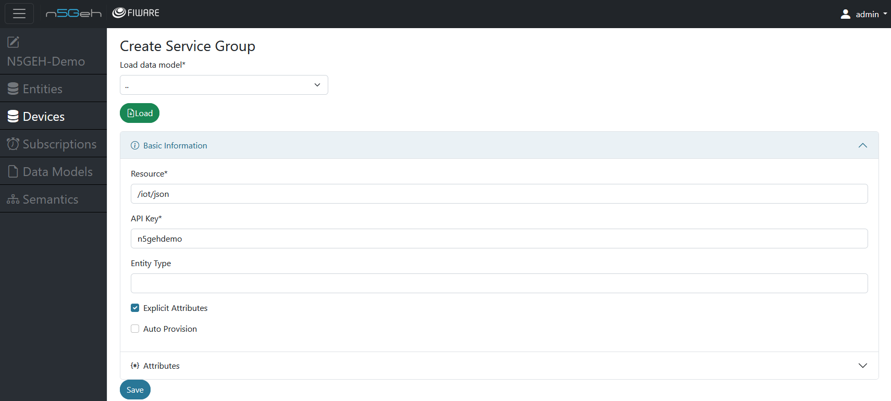
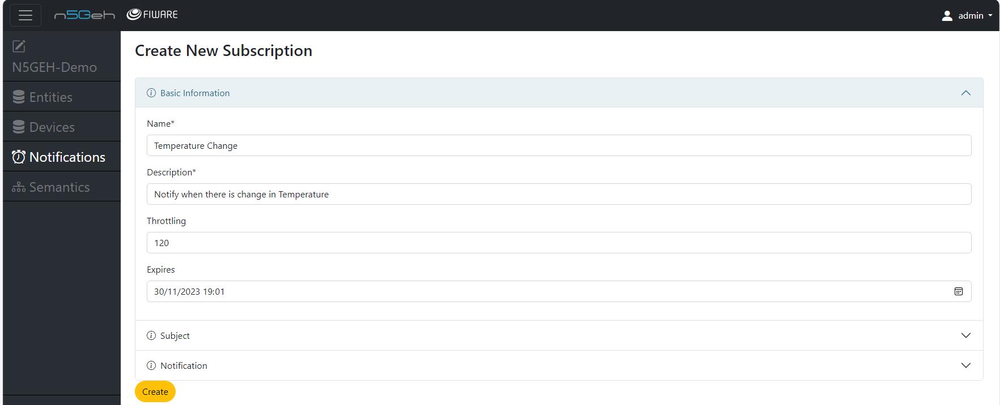

# *SUBSCRIPTIONS MODULE*

The "Notifications" module is designed to interact with the FIWARE Generic Enabler Orion.
This module provides a user interface to manage and view NGSI-v2 `Subscriptions`, which can be used to subscribe to changes in specific entities and attributes, and then forward the data to external endpoints, such as time-series data base.

- [*SUBSCRIPTIONS MODULE*](#subscriptions-module)
  - [*Create New Subscription*](#create-new-subscription)

## *Create New Subscription*
-	Creating a new Subscription: On clicking the blue + , you can create a new Subscription by filling in the `Name`, `Description`(free text to describe the subscription), `Throttling`(Minimum number of seconds that must elapse between two consecutive notifications) and `Expiries`(datetime that this subscription will expire).

-	In the `Subject` section , select the entities and fill in the entity details, you want to subscribe to.

-	In the `Notificaton` section , mention the `HTTP` or `MQTTP` endpoints where you want to recieve the notifications.
-	Include the list of metadata you want to include with the notification.
-	Also select the Attribute format (between `normalized` , `keyValues` or `values`, see more information [here](https://fiware-orion.readthedocs.io/en/master/orion-api.html#notification-messages) )

Back: [Entirety GUI](../GUI_TUTORIALS.md#modules)

Further: [Entirety GUI](../GUI_TUTORIALS.md#modules)
