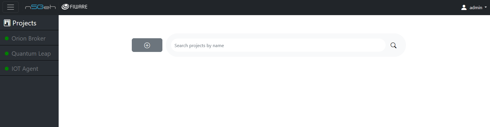
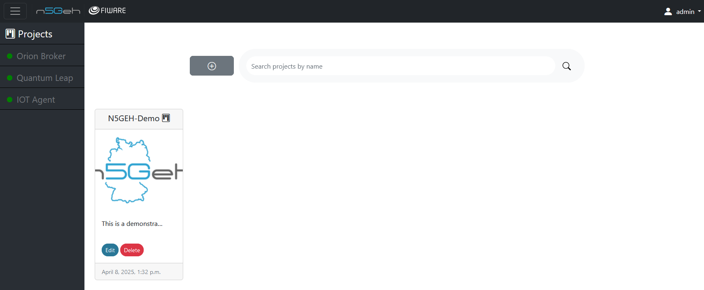

# Entirety User Guide

Entirety is a web-based tool developed to facilitate the work with dedicated FIWARE APIs. It is structured into different modules that are designed to interact with specific FIWARE Generic Enablers (GE). This tutorial will guide you through the basics of the Entirety GUI and then through the usage of each module. 

Note: Usually, we provide useful tooltips to buttons and fields you can read by hovering over them.

##	*LOGIN*

When Entirety is started in local auth mode (check [settings](../docs/SETTINGS.md) for further information), you can login to Entirety with your Entirety username and password. The initial admin credentials can be set in the mentioned settings. Further usernames can be created using the Django admin site, as described [here](../docs/USERMODEL.md#local-authentication). Each account can be assigned different groups and roles, as described in the [usermodel guide](/docs/USERMODEL.md).

When Entirety is not started in local auth mode, the login is handeled by the OpenID Connect (OIDC) provider. The usermodel applies here, as well. Users that are created via OIDC need to have a verified email address and at least the role `User`. Otherwise, a login is not possible for that user.

## *PROJECTS*

After a successful login, the projects will be shown.

Entirety uses the concept of projects to separate the database into independent data spaces. Each project is bound to specific "fiware-service" headers, following FIWARE's approach to [multi-tenancy](https://fiware-orion.readthedocs.io/en/latest/orion-api.html#multi-tenancy). This ensures that data within projects can only be accessed and manipulated from within a project.
-	The Projects page can be accessed by clicking on the top left corner button *Projects*.
-	You can only add a new project if you have the role `Server Admin`.

-	For creating a new project , click on the `+` and fill the fields with you project details, like project name, project description, fiware-service, and webpage url.
-	You can also add a project logo by choosing a file and uploading it.
-	You can assign one owner for the project and select maintainers, users, and viewers.

-	After saving the project, you can review the project information.
-   The available modules are displayed on the left sidebar.
-   To get back to the available projects, click on the `Projects` button in the lower left corner in the sidebar.

-   If you are a `Server Admin`, you can see all available projects. Otherwise, you will see all project your use has access to.
-	In order to access any project data, you need to click on a `project image` or `placeholder / whitespace`.
-	You can edit the project information by clicking on the `edit` button below each project.
-   Delete a project, by clicking on the `delete` button below the project.

## *Connectivity*

The lefthand sidebar shows the connectivity between Entirety and the connected GEs as configured in the settings. If the light is green, the health endpoint is reachable by Entirety. If the light is red, Entirety cannot reach the corresponding health endpoint of the GE.

## *Modules*
Modules are developed to interact with the GEs. 
Currently, Entirety supports interaction with the following Generic Enablers: Orion, IoT Agent-JSON, and (indirectly) QuantumLeap.
Entirety offers the modules `Entities`, `Devices`, `Subscriptions`, `Data Models`, and `Semantics`, that are developed to communicate with these GEs.
The following pages will guide you through the use of each module.

1. [Entities](GUI_TUTORIALS/ENTITIES.md)
2. [Devices](GUI_TUTORIALS/DEVICES.md)
3. [Subscriptions](GUI_TUTORIALS/SUBSCRIPTIONS.md)
4. [Data Models](./GUI_TUTORIALS/DATAMODELS.md)
5. [Semantics](./GUI_TUTORIALS/SEMANTICS.md)
